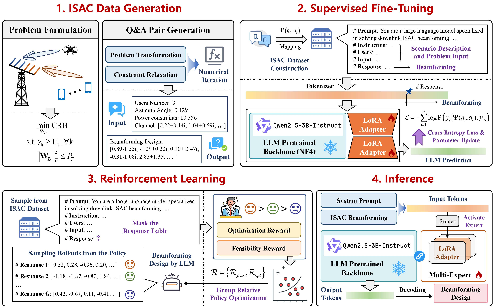
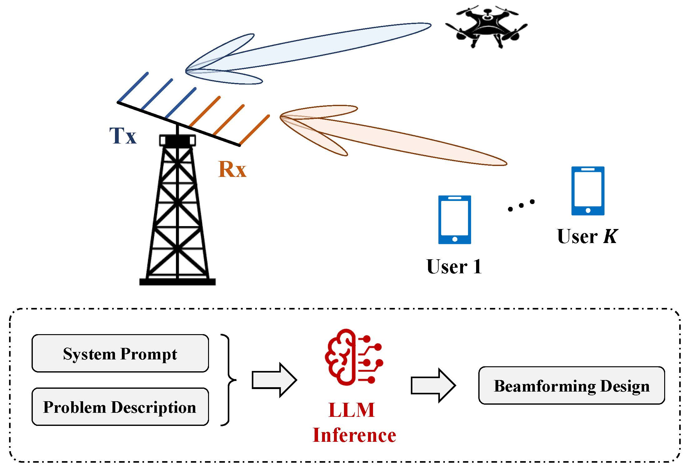
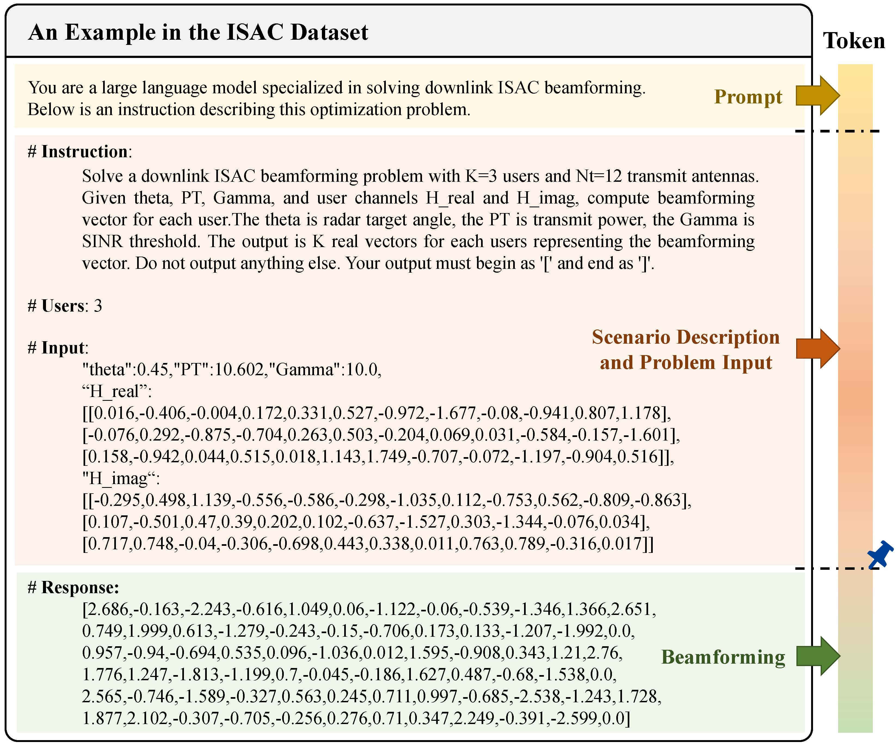

# LLM4BF: LLM for ISAC Beamforming

Official repository for paper:
**From General LLM to Specialized Beamforming for Low-Altitude ISAC Networks: A LoRA-Based Multi-Expert Framework**.

In our work, we provide a general-purpose LLM training framework for the ISAC (Integrated Sensing and Communication) domain. Our training pipeline consists of two main stages: supervised fine-tuning (SFT) and reinforcement learning (RL). The framework is not restricted to any specific ISAC task or wireless communications scenarios. For a given problem, users only need to define the model inputs, outputs, and corresponding prompts, and the framework can be readily applied to train the model.

As a case study, we present experimental results on a beamforming task in the ISAC domain. Our system model is based on the classical work of Cramér-Rao Bound Optimization for Joint Radar-Communication Beamforming [[arXiv]](https://arxiv.org/pdf/2101.12530). Accordingly, this repository also includes a numerical reproduction of the results reported in that paper.

## Absrtact

Integrated sensing and communication (ISAC) achieves both radar sensing and data transmission, yet the design of ISAC beamforming often leads to inherently non-convex optimization problems. Recently, large language models (LLMs), as representatives of general artificial intelligence (AI), have exhibited remarkable capabilities in mathematical reasoning and problem-solving. Empowering ISAC with LLM has thus attracted considerable attention as a promising direction. However, most existing studies simply treat a pretrained LLM as a black-box solver without further adaptation, failing to adapt a general-purpose model into a task-oriented expert. In this paper, we pioneer the use of LLMs to construct an end-to-end ISAC optimizer. We design a multi-expert framework that enables adaptation to diverse ISAC scenarios. Leveraging the strength of LLM in natural language (NL) understanding, we reformulate communication scenarios into NL descriptions, thereby eliminating the need for preprocessing modules and explicit mathematical derivations. Furthermore, inspired by the mixture-of-experts paradigm, we employ low-rank adaptation to specialize the LLM for ISAC optimization, enabling it to generalize across diverse scenarios. We develop a two-stage training framework. In the supervised fine-tuning stage, the model learns to generate solutions with a structured output format. Then, reinforcement learning further refines the outputs to ensure constraint feasibility and numerical optimality. Extensive experiments demonstrate that our approach achieves superior performance, significantly outperforming existing AI-based methods.

## Highlights

* 🧠 The first open-source LLM framework tailored for the ISAC domain
* 🔁 Fully open-source codebase with a reproducible training pipeline
* 💻 Supports experiments on consumer-grade GPUs (single NVIDIA GeForce RTX 4080 or NVIDIA GeForce RTX 4090)
* 🚀 Built on open LLM backbones (Qwen) and tooling (Unsloth, Hugging Face)

## Code

This study mainly consists of two stages, namely SFT, and RL, which correspond to `tarin.py` and `rl.py`, respectively. Following the order presented in the paper, `tarin.py` is executed first to save the trained LoRA, which is then loaded in `rl.py` for further training. `eval.py` is used to evaluate model performance, and this file only tests a single LoRA module. `eval_adapter.py` adopts a mixture of experts framework, which requires training multiple LoRA modules and loading them into the same backbone model. Since `eval.py` only considers one LoRA, the test data can be evaluated in batches, resulting in much faster evaluation. In contrast, `eval_adapter.py` only supports sequential evaluation.

## Training

The training process consists of four main stages:

### 1. Environment Preparation

We use the fine-tuning framework provided by [Unsloth](https://github.com/unslothai/unsloth), which significantly reduces GPU memory usage and improves the efficiency of LLM fine-tuning. Therefore, you need to install Unsloth first. Please refer to its official [documentation](https://unsloth.ai/docs) for detailed instructions. **Note that automatic installation via pip uninstalls the existing PyTorch environment and installs the latest version of PyTorch.**

Our project is based on **Qwen2.5-3B-Instruct**, so you need to download the base model in advance. You may choose to download the official 16-bit [version](https://huggingface.co/Qwen/Qwen2.5-3B-Instruct). However, we strongly recommend using the 4-bit [version](https://huggingface.co/unsloth/Qwen2.5-3B-Instruct-unsloth-bnb-4bit) provided by Unsloth, which significantly reduces GPU memory consumption and accelerates inference. According to our experimental results, the performance gap between the 16-bit and 4-bit versions is relatively small, making the 4-bit model sufficient for most use cases. If you plan to handle more complex environments or tasks, you can switch to a larger base model.

You can download the base model using the following command. The model files will be stored in the `model_cache` folder of the current project.

~~~
hf download unsloth/Qwen2.5-3B-Instruct-unsloth-bnb-4bit --local-dir ./model_cache
~~~

If you encounter network issues, we recommend downloading the model using third-party tools. An example command is provided below.

~~~
modelscope download --model unsloth/Qwen2.5-3B-Instruct-unsloth-bnb-4bit --cache_dir ./model_cache
~~~

For other environment dependencies, please refer to the `requirements.txt` file.

### 2. Supervised Fine-Tuning

Default parameters are configured in `tarin.py`, and it can be executed directly.

#### Key Arguments

* `--max_seq_length`
  Maximum sequence length. If your task is relatively simple and GPU memory is limited, you can reduce this value accordingly.

* `--local_file`
  Whether to load the base model from a local path. If set to `False`, the model will be downloaded from the internet based on the specified model name.

* `--model_name`
  Name of the base model. If loading from a local file, this should be set to the local path of the model.

* `--data_dir`
  Path to the dataset. JSON format is recommended. If you switch to a different task, you may need to modify the `get_isac_sft_datasets` function to adapt to the new data parsing requirements.

* `--lora_r`
  Rank of the LoRA module.

* `--learning_rate`
  We recommend using a relatively large learning rate during the SFT stage, while reducing it during the RL stage to avoid training instability or collapse.

* `--output_dir`
  Directory where training logs and checkpoints will be saved.

### 3. Reinforcement Learning 

During the RL stage, the LLM is further fine-tuned based on the model obtained from the SFT stage. Note that a smaller learning rate should be used during RL, and gradient clipping is necessary to avoid training instability or collapse.

#### Key Arguments

* `--max_completion_length`
  Maximum number of tokens generated by the model. This should be adjusted according to the specific task. If set too large, the model may produce overly long and less constrained outputs, which can lead to training instability or collapse.

* `--model_path`
  Path to the checkpoint obtained from the first-stage (SFT) training.

* `--base_model`
  Path to the base model.

* `--num_generations`
  Number of candidate outputs generated by the model for reward computation and parameter updates.

* `--max_grad_norm`
  Maximum norm for gradient clipping.

### 4. Testing

If GPU memory is limited, `eval.py` is recommended for evaluation, which tests only a single LoRA module and achieves faster execution. During the evaluation stage, you need to set the `--model_path` argument to the checkpoint saved from the RL stage. Two evaluation modes are provided. The `vanilla` mode allows the LLM to generate only one solution, whereas `best_of_n` generates multiple solutions and selects the optimal one as the output.

`eval_adapter.py` loads multiple LoRA modules corresponding to different scenarios. At this stage, you need to set the `LORA_PATHS` dictionary to the corresponding LoRA checkpoint paths. The code automatically routes the input data to the appropriate LoRA to ensure accurate output.

## Data

Our input data is derived from the analytical solution of the system model presented in the paper. In `isac_solve.m`, we implement the numerical solution in MATLAB. Therefore, `isac_solve.m` needs to be executed to generate the training data. The generated data is stored in `.mat` format. Subsequently, the `.mat` files need to be converted into `.json` files. The format of the `.json` files must strictly follow the specification described in the paper, otherwise the code logic in model training and evaluation requires corresponding modification. 

## Open Source

At this stage, we provide the dataset used in our experiments. The model weights will be released after the paper is accepted.

## Acknowledge

Unsloth: https://github.com/unslothai/unsloth

LLMCoSolver: https://arxiv.org/abs/2509.16865

Cramér-Rao Bound Optimization: https://ieeexplore.ieee.org/abstract/document/9652071
